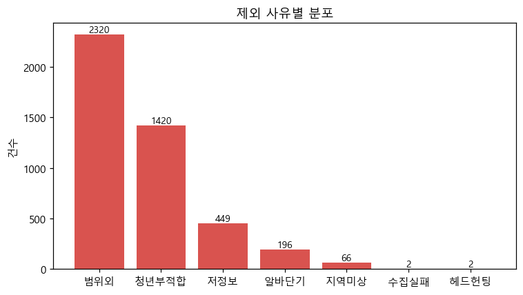
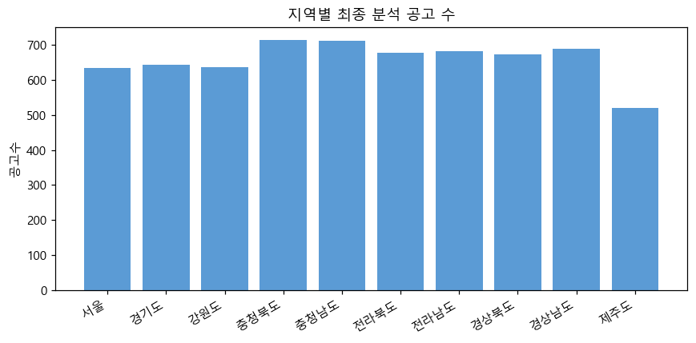
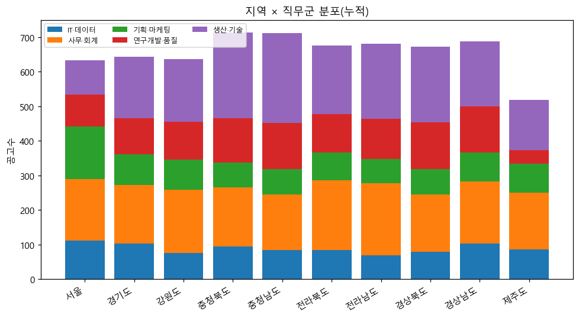
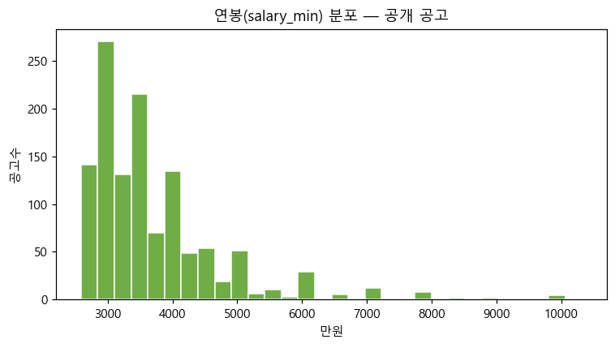
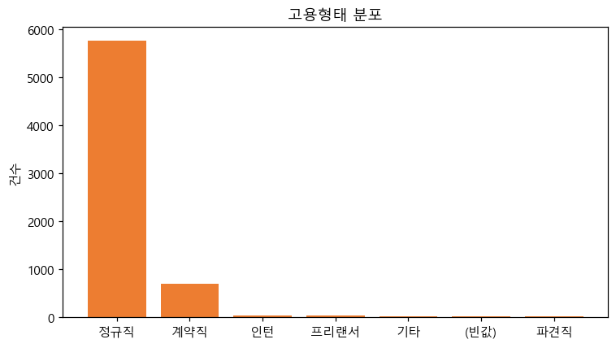
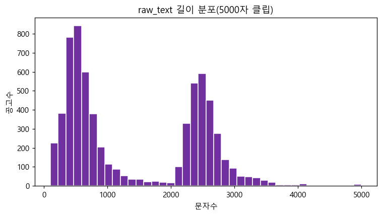
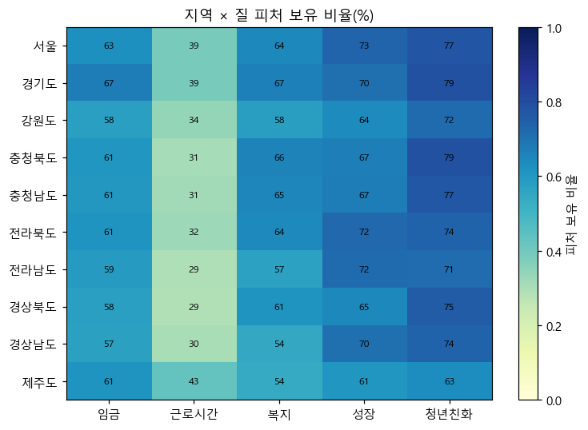
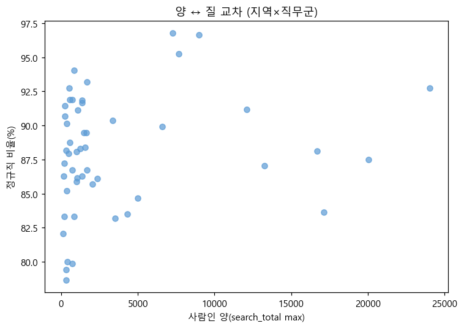

# 통합 데이터셋 기초 EDA 리포트

- 원본: 사람인 5500 + 잡코리아 5500 = 11000
- 통합 라벨셋: 11000 / 필터통과: 6885 / 최종(중복제거): 6575
- 점수화(정규화·가중합)는 범위 밖, 기초 기술통계만.

## 1. 원본 데이터 수집 현황
| 출처 | 행수 | 지역수 | 미분류(원본) | 미분류율 |
| --- | --- | --- | --- | --- |
| 사람인 | 5500 | 10 | 221 | 4.0% |
| 잡코리아 | 5500 | 10 | 2318 | 42.1% |

## 2. 출처별 품질 비교 (통합 라벨셋)
| 출처 | 행수 | 정규직 | 급여공개 | 청년친화 | raw_text 중앙값 |
| --- | --- | --- | --- | --- | --- |
| 사람인 | 5500 | 92.1% | 21.9% | 77.0% | 532 |
| 잡코리아 | 5500 | 80.7% | 41.5% | 99.5% | 2516 |

## 3. 중복 제거 전후 비교
| 구분 | 값 |
| --- | --- |
| 제거 전(필터통과) | 6885 |
| 제거 | 310 |
| 제거 후(최종) | 6575 |
| 출처내 제거 | 198 |
| 출처간 제거 | 112 |
| 사람인 제거 | 81 |
| 잡코리아 제거 | 229 |

## 4. 최종 포함/제외 요약 (퍼널)
| 단계 | 행수 |
| --- | --- |
| 통합 라벨셋 | 11000 |
| 품질필터 포함 | 6885 |
| 품질필터 제외 | 4115 |
| 중복 제거 | 310 |
| 최종 분석셋 | 6575 |

## 5. 제외 사유별 분포 (중복집계)
| 사유 | 건수 |
| --- | --- |
| 범위외 | 2320 |
| 청년부적합 | 1420 |
| 저정보 | 449 |
| 알바단기 | 196 |
| 지역미상 | 66 |
| 수집실패 | 2 |
| 헤드헌팅 | 2 |

## 6. 지역별 최종 분석 공고 수
| 지역 | 공고수 |
| --- | --- |
| 서울 | 633 |
| 경기도 | 643 |
| 강원도 | 636 |
| 충청북도 | 714 |
| 충청남도 | 712 |
| 전라북도 | 676 |
| 전라남도 | 681 |
| 경상북도 | 673 |
| 경상남도 | 688 |
| 제주도 | 519 |

## 7. 지역 × 직무군 분포
| 지역 | IT·데이터 | 사무·회계 | 기획·마케팅 | 연구개발·품질 | 생산·기술 | 합계 |
| --- | --- | --- | --- | --- | --- | --- |
| 서울 | 112 | 177 | 152 | 93 | 99 | 633 |
| 경기도 | 102 | 170 | 89 | 105 | 177 | 643 |
| 강원도 | 75 | 184 | 86 | 110 | 181 | 636 |
| 충청북도 | 94 | 172 | 71 | 128 | 249 | 714 |
| 충청남도 | 84 | 161 | 74 | 132 | 261 | 712 |
| 전라북도 | 83 | 203 | 81 | 110 | 199 | 676 |
| 전라남도 | 68 | 210 | 70 | 115 | 218 | 681 |
| 경상북도 | 78 | 166 | 74 | 135 | 220 | 673 |
| 경상남도 | 102 | 180 | 84 | 133 | 189 | 688 |
| 제주도 | 86 | 164 | 84 | 39 | 146 | 519 |

## 8. 출처 × 직무군 분포
| 출처 | IT·데이터 | 사무·회계 | 기획·마케팅 | 연구개발·품질 | 생산·기술 |
| --- | --- | --- | --- | --- | --- |
| 사람인 | 504 | 1132 | 555 | 727 | 938 |
| 잡코리아 | 380 | 655 | 310 | 373 | 1001 |

## 9. 임금 공개율 및 분포
| 지표 | 값 |
| --- | --- |
| 급여 수치 공개율 | 29.1% |
| 연봉 표본수(만원) | 1218 |
| 연봉 중앙값 | 3,500만원 |
| 연봉 평균 | 3,715만원 |

## 10. 고용형태 분포
| 고용형태 | 건수 |
| --- | --- |
| 정규직 | 5759 |
| 계약직 | 696 |
| 인턴 | 34 |
| 프리랜서 | 34 |
| 기타 | 19 |
| (빈값) | 18 |
| 파견직 | 15 |

## 11. raw_text 길이 분포
| 지표 | 값 |
| --- | --- |
| 중앙값 | 870 |
| 평균 | 1432 |
| 최소/최대 | 100 / 9223 |

## 12. 지역별 키워드 피처 포함 비율
| 지역 | 임금 | 근로시간 | 복지 | 성장 | 청년친화 |
| --- | --- | --- | --- | --- | --- |
| 서울 | 62.6% | 38.7% | 64.5% | 73.1% | 77.3% |
| 경기도 | 67.3% | 38.9% | 66.6% | 70.5% | 78.5% |
| 강원도 | 57.7% | 34.0% | 58.2% | 63.8% | 71.5% |
| 충청북도 | 60.6% | 30.7% | 66.0% | 66.7% | 78.6% |
| 충청남도 | 60.5% | 31.5% | 65.2% | 67.1% | 76.7% |
| 전라북도 | 60.9% | 32.2% | 64.1% | 72.3% | 73.7% |
| 전라남도 | 59.2% | 28.9% | 56.7% | 71.5% | 71.4% |
| 경상북도 | 57.7% | 28.7% | 61.2% | 64.8% | 75.5% |
| 경상남도 | 57.1% | 30.4% | 54.4% | 70.5% | 73.7% |
| 제주도 | 61.1% | 42.6% | 53.6% | 60.9% | 63.4% |

## 13. 공공기관 플래그 분포 (최종셋)
| 구분 | 값 |
| --- | --- |
| 공공기관 | 66 |
| 민간 | 6509 |
| 공공 비율 | 1.0% |
| 지역 | 공공기관수 |
| --- | --- |
| 경기도 | 1 |
| 강원도 | 15 |
| 충청북도 | 6 |
| 충청남도 | 5 |
| 전라북도 | 5 |
| 전라남도 | 11 |
| 경상북도 | 14 |
| 경상남도 | 3 |
| 제주도 | 6 |

### 13-1. 공공 vs 민간 질 비교
| 구분 | 정규직 | 급여공개 | 청년친화(평균) | 복지(평균) |
| --- | --- | --- | --- | --- |
| 공공 | 50.0% | 21.2% | 2.74 | 0.92 |
| 민간 | 88.0% | 29.2% | 1.98 | 1.74 |

## 14. 최종 분석셋 요약
| 항목 | 값 |
| --- | --- |
| 행수 | 6575 |
| 출처 | {'사람인': 3856, '잡코리아': 2719} |
| 지역수 | 10 |
| 직무군수 | 5 |
| 정규직 비율 | 87.6% |
| 급여공개 비율 | 29.1% |
| 공공기관 | 66 |

## A. 지역별 양 ↔ 질
| 지역 | 사람인 양(max합) | 최종표본수 | 정규직 | 급여공개 | 청년친화(평균) |
| --- | --- | --- | --- | --- | --- |
| 서울 | 75,051 | 633 | 89.4% | 19.0% | 2.06 |
| 경기도 | 58,709 | 643 | 90.7% | 25.3% | 2.14 |
| 강원도 | 2,446 | 636 | 84.7% | 23.9% | 1.90 |
| 충청북도 | 7,819 | 714 | 88.8% | 25.4% | 2.11 |
| 충청남도 | 10,105 | 712 | 87.6% | 22.5% | 2.06 |
| 전라북도 | 3,971 | 676 | 90.4% | 40.2% | 1.94 |
| 전라남도 | 2,841 | 681 | 85.6% | 38.3% | 1.90 |
| 경상북도 | 8,120 | 673 | 87.1% | 28.8% | 2.02 |
| 경상남도 | 11,198 | 688 | 87.4% | 30.8% | 1.99 |
| 제주도 | 1,046 | 519 | 83.2% | 38.5% | 1.71 |

## B. 직무군별 양 ↔ 질
| 직무군 | 사람인 양(max합) | 최종표본수 | 정규직 | 급여공개 |
| --- | --- | --- | --- | --- |
| IT·데이터 | 38,353 | 884 | 86.7% | 22.1% |
| 사무·회계 | 41,035 | 1787 | 85.1% | 38.1% |
| 기획·마케팅 | 36,845 | 865 | 91.3% | 25.5% |
| 연구개발·품질 | 22,225 | 1100 | 90.7% | 20.2% |
| 생산·기술 | 42,848 | 1939 | 86.8% | 30.8% |

## C. 양 ↔ 질 교차 (지역×직무군 산점도)
x=사람인 양(search_total max), y=정규직 비율. 우하단(양 많고 질 낮음) 주목.

